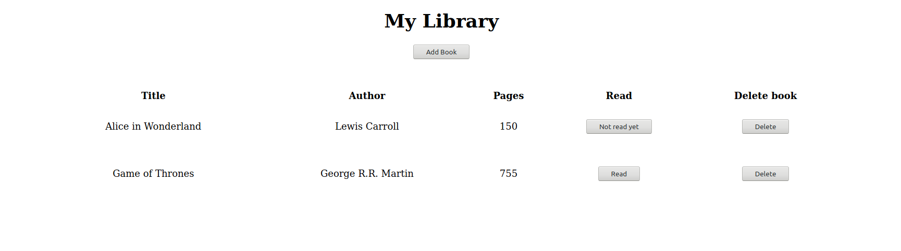

# Library App

> A simple library app where users can add/delete books and keep track of the reading status.

## Built With

- HTML5
- CSS3
- JavaScript

## Live Demo

[Live Demo Link](https://livedemo.com)

## Getting Started

To get a local copy up and running follow these simple example steps.

### Setup and Install

- Clone this repository using the link above (click on the 'code' button)
- Open a terminal and `cd` to the cloned repository
- Open a live server in your preferred browser

### Usage

- Click on 'Add Book' to add a book
- Click on 'Delete' to delete a book
- Click on 'Read' or 'Not read yet' to update the status of a book

### Deployment

- Deployed on GitHub Pages

## Authors

👤  **Rocio Martinez** 
- Github: [@Rocio01](https://github.com/Rocio01) 
- Twitter: [@rugiada8801](https://twitter.com/rugiada8801) 
- Linkedin: [zulma-rocio-martinez](https://www.linkedin.com/in/zulma-rocio-martinez) 

👤 **Alicia Rojas**

- GitHub: [@aliciapaz](https://github.com/aliciapaz)
- Twitter: [@_alicia_paz](https://twitter.com/_alicia_paz)
- LinkedIn: [Alicia Rojas](https://www.linkedin.com/in/aliciapazrojas/)

## 🤝 Contributing

Contributions, issues, and feature requests are welcome!

Feel free to check the [issues page](https://github.com/Rocio01/Library/issues).

## Show your support

Give a ⭐️ if you like this project!

## Acknowledgments

- [The Odin Project](https://www.theodinproject.com/paths/full-stack-ruby-on-rails/courses/javascript/lessons/library)

## 📝 License

This project is [MIT](LICENSE) licensed.
